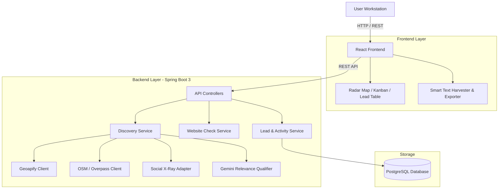

<p align="center">
  
</p>

# SETULEADS — STRUCTURAL WEB INSPECTION & PROSPECT DISCOVERY ENGINE

SetuLeads is a single-user prospect discovery and CRM workstation built for finding local and digital-first businesses that need web development, website revamps, or technical digital infrastructure upgrades.

─────────────────────────────────────────────

## 01  WHAT THIS IS

SetuLeads started from a simple problem: finding local businesses that actually need web work takes too many browser tabs.

Finding potential clients usually isn't the hardest part. The messy part is sifting through map markers, verifying whether a business actually has a functional website, checking basic SSL or mobile responsiveness, grabbing contact details, and organizing those prospects without drowning in a bloated enterprise CRM.

SetuLeads puts that process into one workstation interface:

```
FIND ──► VERIFY ──► INSPECT ──► QUALIFY ──► SAVE ──► CONTACT
```

It combines local map discovery, indexed web/social discovery, automated website technical checks, and a lightweight sales pipeline.

─────────────────────────────────────────────

## 02  WORKFLOW ENGINE

The core pipeline processes raw candidates through controlled normalization stages:

```
Search Query
   │
   ▼
Multi-Source Discovery (Geoapify / OpenStreetMap / Social X-Ray / Text Harvester)
   │
   ▼
Candidate Normalization & Deduplication
   │
   ▼
Gemini Relevance & Intent Qualification
   │
   ▼
Backend Website Inspection (HTTP / SSL / Mobile / Tech Debt)
   │
   ▼
CRM Workstation (Kanban / Inspection Drawer / Notes / Activity Log)
   │
   ▼
Outreach & SheetJS Excel Export
```

─────────────────────────────────────────────

## 03  DISCOVERY ARCHITECTURE

SetuLeads uses a multi-source model rather than relying on a single provider directory.

### Local & Map POI Discovery
- **Geoapify Places API**: Radius and spatial boundary queries for physical business locations.
- **OpenStreetMap / Overpass API**: Open geospatial data extraction for regional categories.

*Primary use case*: Local contractors, restaurants, repair shops, professional services, and physical storefronts.

### Digital Discovery & Social X-Ray
- **Social X-Ray Adapter**: Query patterns targeting indexed public profiles across Instagram, LinkedIn, Linktree, and Facebook.

*Why this exists*: Map directories work well for physical storefronts, but early-stage businesses, creative agencies, and digital-first services often build a social or Linktree presence long before setting up a map listing or traditional website.

─────────────────────────────────────────────

## 03.1  SOCIAL X-RAY DISCOVERY

Not every business starts with a website or a map listing.

Some businesses live on Instagram.  
Some exist primarily through LinkedIn.  
Some use Linktree as their entire digital presence.  

Social X-Ray gives SetuLeads another way to find them.

Social X-Ray is an advanced search technique using search-engine operators and targeted keywords to discover publicly indexed pages on specific domains.

### Terminology

- **X-Ray Search**: A targeted search technique that searches within a specific website/domain using search operators and contextual keywords.
- **Search Operators**: Special instructions such as `site:` that restrict where search results come from.
- **Exact-match terms**: Quoted phrases such as `"startup"` or `"Los Angeles"` that help constrain the search context.

### Example Query Breakdown

```
site:instagram.com "startup" "Los Angeles" "@gmail.com"
```

- `site:instagram.com` → Search only pages indexed from Instagram.
- `"startup"` → Search for the target business/category.
- `"Los Angeles"` → Add geographic context.
- `"@gmail.com"` → Look for pages/snippets containing a common public contact pattern.

> **Engineering Note**: Search engine indexing can be incomplete or stale, and search engines only expose publicly indexed content. Social X-Ray is therefore designed as a candidate discovery and evidence layer, not a guaranteed extraction or complete coverage claim.

---

### WHY MAP SEARCH IS NOT ENOUGH

Traditional place/business discovery is useful for physical storefronts, but it can miss:

- Early-stage startups
- Creators and agencies
- Digital-first businesses
- Freelancers
- Small businesses operating primarily through social media
- Businesses using Linktree instead of a traditional website
- Businesses with weak or incomplete directory presence

```
MAP SEARCH
    │
    ▼
Physical businesses ──► Business listings ──► Known locations

vs.

SOCIAL X-RAY
    │
    ▼
Indexed public profiles ──► Digital-first businesses ──► Social/contact signals
```

SetuLeads combines map POI search (Geoapify, OpenStreetMap) with Social X-Ray rather than replacing one with the other.

---

### HOW AN X-RAY QUERY WORKS

```
┌────────────────────┐   ┌───────────┐   ┌────────────────┐   ┌───────────────┐
│ site:instagram.com │ + │ "startup" │ + │ "Los Angeles"  │ + │ "@gmail.com"  │
└────────────────────┘   └───────────┘   └────────────────┘   └───────────────┘
     DOMAIN TARGET        INTENT TERM     LOCATION SIGNAL      CONTACT SIGNAL
```

- **Domain Target** (`site:instagram.com`): Restricts search results to indexed pages on the specified domain.
- **Intent Term** (`"startup"`): Defines what kind of prospect or category we are searching for.
- **Location Signal** (`"Los Angeles"`): Constrains results to a target region or city.
- **Contact Signal** (`"@gmail.com"`): Surfaces pages containing public email patterns or outreach handles.

---

### QUERY → RESULT PIPELINE

```
USER INTENT
     │
     ▼
QUERY BUILDER ─────────────── [QUERY BUILT]
     │
     ▼
SEARCH ENGINE INDEX ───────── [SEARCHING INDEX]
     │
     ▼
INDEXED PUBLIC RESULTS ────── [RESULTS FOUND]
     │
     ▼
RESULT EXTRACTION ─────────── [EXTRACTING SIGNALS]
     │
     ▼
NORMALIZATION ─────────────── [NORMALIZING]
     │
     ▼
RELEVANCE QUALIFICATION ──── [QUALIFYING]
     │
     ▼
DEDUPLICATION ─────────────── [DEDUPLICATING]
     │
     ▼
SETULEADS CRM ─────────────── [READY FOR CRM]
```

---

### X-RAY QUERY PATTERNS

| Platform | Query Pattern Example | Target Purpose | Useful Signals | Limitations |
| :--- | :--- | :--- | :--- | :--- |
| **Instagram** | `site:instagram.com "startup" "Los Angeles"` | Surface creators, local boutiques, & visual services | Bio contact text, Linktree links, DMs | Dynamic JS rendering, index latency |
| **LinkedIn** | `site:linkedin.com/company "startup" "Los Angeles"` | Discover corporate B2B services & tech startups | Employee count, official domains, tagline | Gated profile details, snippet limits |
| **Linktree** | `site:linktr.ee "startup" "Los Angeles"` | Find micro-businesses using Linktree as sole web presence | Portfolio links, store URLs, booking links | Limited context on root linktree landing |
| **Facebook** | `site:facebook.com "startup" "Los Angeles" "email"` | Target local service providers & community businesses | Operating hours, direct email, phone numbers | Privacy restrictions, snippet truncation |

---

### HOW SETULEADS USES IT

```
DISCOVERY SOURCES
(Geoapify + OpenStreetMap + Social X-Ray + Smart Text Harvester)
                     │
                     ▼
          CANDIDATE NORMALIZATION
                     │
                     ▼
          RELEVANCE QUALIFICATION
                     │
                     ▼
               DEDUPLICATION
                     │
                     ▼
             WEBSITE INSPECTION
                     │
                     ▼
                 SETULEADS CRM
```

**Core Principle**:
```
SEARCH RESULT ≠ QUALIFIED BUSINESS
```

Social X-Ray is a **discovery mechanism**, not the qualification system itself. A search engine result does not automatically become a qualified lead:

1. **Search Results** → Raw candidates
2. **Candidates** → Normalized schema
3. **Normalized Candidates** → Gemini relevance checked
4. **Relevant Candidates** → Deduplicated against CRM
5. **Candidates with Discovered Websites** → Automated HTTP/SSL/Mobile inspection
6. **Qualified Prospects** → Saved to CRM workstation

---

### SMART TEXT HARVESTER INTEGRATION

> *"Search results are discovery evidence, not automatically structured CRM records."*

```
COPIED SEARCH / PAGE TEXT
           │
           ▼
  SMART TEXT HARVESTER (Regex + Sanitizer)
           │
           ├──► Business Name
           ├──► Email Address
           ├──► Phone / WhatsApp
           ├──► Website Domain
           └──► Instagram / LinkedIn Handle
           │
           ▼
   PREVIEW & VALIDATION MODAL
           │
           ▼
    IMPORT TO CRM WORKSTATION
```

---

### WHY X-RAY SEARCH MATTERS

- **01 — DISCOVERY DIVERSITY**: Adds indexed social/digital discovery alongside traditional geospatial sources.
- **02 — DIGITAL-FIRST COVERAGE**: Surfaces businesses operating primarily through social media or Linktree without a traditional map listing.
- **03 — TARGETED SEARCH**: Combines domain, intent, location, and contact patterns for high-precision queries.
- **04 — MULTI-SOURCE SIGNALS**: Complements Geoapify and OpenStreetMap candidates to build rich prospect profiles.
- **05 — LOW-FRICTION DISCOVERY**: Adaptable across industries, geographic markets, and social platforms.
- **06 — HUMAN-IN-THE-LOOP OPTION**: Integrates with Smart Text Harvester so users preview and validate extracted candidates before saving.

---

### ENGINEERING LIMITATIONS

- Search engine indexing is incomplete and varies by platform.
- Public search snippets can be stale or truncated.
- Social profiles may represent personal accounts rather than operating businesses.
- Similar business names across cities can produce false-positive matches.
- Search engine ranking and indexing algorithms change dynamically.
- Automated search queries are subject to provider terms, rate limits, and anti-bot protections.
- Extracted contact details require human preview and semantic qualification.
- X-Ray discovery is therefore treated as a **candidate discovery/evidence layer**, not ground truth.

─────────────────────────────────────────────

## 04  QUALIFICATION & ACCURACY

A core principle in SetuLeads is that a raw search result is not automatically a business:

```
SEARCH RESULT != QUALIFIED BUSINESS
```

Search engines return blog posts, articles, directory aggregators, personal profiles, and unrelated pages alongside actual businesses. Treating every search result as a lead leads to polluted databases.

SetuLeads normalizes and qualifies candidates before saving them:

- **Entity Type & Relevance**: Evaluates whether the candidate is a business, individual, or directory listing.
- **Geographic Context**: Validates location markers against search intent.
- **Quality over Volume**: 40 clean, verified candidates are far more useful than 200 unvetted links containing false positives.

### Deduplication Strategy
Candidate records are matched across incoming streams using:
1. Provider unique identifier
2. Normalized domain name
3. Phone number
4. Social handle
5. Business name combined with geographic proximity

This strategy prevents duplicate entries while avoiding accidental merges of separate businesses with similar names.

─────────────────────────────────────────────

## 05  WEBSITE INSPECTION

When a website URL is discovered, SetuLeads performs an automated backend inspection to evaluate observable technical signals:

Endpoint: `POST /api/v1/websites/check`

### Observable Checks
- **HTTP Status Code**: Verifies site accessibility (e.g., `200 OK`, `404`, `500`).
- **Response Latency**: Measures initial server response time.
- **HTTPS & SSL Validity**: Checks for active SSL certificates.
- **Viewport Tag**: Verifies presence of mobile viewport meta tags.
- **Page Metadata**: Extracts page title and meta description.
- **Technical Debt Signals**: Identifies outdated design structures or missing performance markers.

If an inspection fails due to server timeouts or DNS errors, the record is flagged as `INSPECTION_FAILED` rather than fabricating a fake zero score.

*Note*: "No website discovered" is explicitly tracked separately from "Confirmed business has no website".

─────────────────────────────────────────────

## 06  CRM WORKSTATION

SetuLeads is designed as a focused single-user prospecting workspace rather than an enterprise multi-tenant CRM.

### Pipeline Stages
- `NEW`: Discovered and imported candidates awaiting initial contact.
- `CONTACTED`: First outreach sent.
- `REPLIED`: Prospect responded.
- `NEGOTIATING`: Proposal or audit discussion in progress.
- `WON`: Client engaged.
- `LOST`: Prospect declined or unsuitable.

### Key Capabilities
- **Kanban Board**: Drag-and-drop stage updates.
- **Inspection Drawer**: Deep dive into contact details, audit notes, social links, and activity logs.
- **Activity Log**: Endpoint `POST /api/v1/leads/{id}/activities` tracks call notes, stage updates, and email logs.
- **Excel Export**: Endpoint `GET /api/v1/leads/export` and client-side SheetJS generate formatted `.xlsx` spreadsheets for offline review.

─────────────────────────────────────────────

## 07  SYSTEM ARCHITECTURE

All external API calls and provider queries originate from the Spring Boot backend. The React frontend does not expose provider API keys.



─────────────────────────────────────────────

## 08  TECH STACK

### Frontend
- **Framework**: React 19, TypeScript, Vite
- **Styling**: Tailwind CSS v4, shadcn/ui, Framer Motion
- **Icons**: Phosphor Icons, Lucide Icons
- **State & Data Fetching**: TanStack Query (React Query v5)
- **Excel Export**: SheetJS (`xlsx`)

### Backend
- **Framework**: Java 17, Spring Boot 3.x
- **Data & Persistence**: Spring Data JPA, Hibernate, PostgreSQL
- **Export & Utilities**: Apache POI (`poi-ooxml`), Jakarta Validation
- **Build Tool**: Apache Maven

### Discovery & Intelligence
- **Geospatial**: Geoapify Places API, OpenStreetMap / Overpass API
- **Social & Search**: Social X-Ray search adapters
- **AI Qualification**: Google Gemini API (`RelevanceQualifier`)

─────────────────────────────────────────────

## 09  PROJECT STRUCTURE

```
setuleads/
├── frontend/                     # Client application (React + Vite)
│   ├── src/
│   │   ├── api/                  # API client functions
│   │   ├── assets/               # Brand SVGs & static assets
│   │   ├── components/           # UI, layout, and visualizer components
│   │   ├── hooks/                # Custom React Query hooks
│   │   ├── lib/                  # Utilities & Excel exporter
│   │   └── pages/                # Main application views & Case Study
│   ├── public/                   # Favicon and static files
│   ├── index.html
│   ├── package.json
│   └── vite.config.ts
│
├── backend/                      # Service application (Spring Boot)
│   ├── src/
│   │   ├── main/java/com/setuleads/
│   │   │   ├── config/           # Web & CORS configuration
│   │   │   ├── controller/       # REST API endpoints
│   │   │   ├── dto/              # Request & Response Data Transfer Objects
│   │   │   ├── entity/           # JPA Database Entities
│   │   │   ├── integration/      # Geoapify, OSM, Gemini & X-Ray clients
│   │   │   ├── repository/       # Spring Data Repositories
│   │   │   └── service/          # Business logic & qualification engines
│   │   └── test/java/com/setuleads/
│   └── pom.xml
│
├── package.json                  # Root orchestration scripts
├── .gitignore
└── README.md
```

─────────────────────────────────────────────

## 10  LOCAL SETUP

### Prerequisites
- Node.js v18+
- JDK 17+
- Maven 3.8+
- PostgreSQL database instance

### 1. Environment Configuration

Create a `.env` file inside `frontend/`:
```env
VITE_API_BASE_URL=http://localhost:8080
```

Configure backend environment variables in `backend/src/main/resources/application.properties` (or environment):
```properties
SPRING_DATASOURCE_URL=jdbc:postgresql://localhost:5432/setuleads
SPRING_DATASOURCE_USERNAME=your_db_user
SPRING_DATASOURCE_PASSWORD=your_db_password

GEOAPIFY_API_KEY=your_geoapify_key
GEMINI_API_KEY=your_gemini_key
```

### 2. Frontend Development Server

```bash
# From project root
cd frontend
npm install
npm run dev
```
The frontend will start at `http://localhost:5173`.

### 3. Backend Service Server

```bash
# From project root
cd backend
mvn spring-boot:run
```
The backend API server will run on `http://localhost:8080`.

─────────────────────────────────────────────

## 11  TESTING & VERIFICATION

### Automated Verification Commands

```bash
# Execute Frontend Production Build
npm run build

# Execute Backend Test Suite
npm run test:backend
```

### Manual Verification Checklist
- **Search Execution**: Run a real query (e.g., "Plumbers in Austin, TX") and verify candidates are returned.
- **Provider Fallback**: Verify discovery handles API failures gracefully without crashing the UI.
- **Smart Text Harvester**: Paste a raw text block into the Harvester modal and verify extracted fields.
- **Website Inspection**: Trigger inspection on a lead and verify response code, SSL status, and viewport flags.
- **Pipeline Stage Sync**: Drag a lead across Kanban columns and confirm database persistence.
- **Excel Export**: Click "Export to Excel" and verify the generated `.xlsx` file.

─────────────────────────────────────────────

## 12  REST API REFERENCE

| Method | Endpoint | Description |
| :--- | :--- | :--- |
| `POST` | `/api/v1/discovery/search` | Trigger multi-source candidate discovery query |
| `POST` | `/api/v1/websites/check` | Execute backend technical website inspection |
| `GET` | `/api/v1/leads` | Retrieve leads list with optional stage/source filtering |
| `GET` | `/api/v1/leads/{id}` | Retrieve single lead details |
| `POST` | `/api/v1/leads` | Save a new qualified lead manually |
| `PUT` | `/api/v1/leads/{id}` | Update existing lead record details |
| `DELETE` | `/api/v1/leads/{id}` | Remove a lead record |
| `POST` | `/api/v1/leads/{id}/stage` | Update pipeline stage (`NEW`, `CONTACTED`, etc.) |
| `POST` | `/api/v1/leads/harvest-paste` | Parse raw text stream and import candidate leads |
| `POST` | `/api/v1/leads/generate-outreach` | Generate personalized AI pitch hook for a candidate |
| `GET` | `/api/v1/leads/{leadId}/activities` | Get activity log for a specific lead |
| `POST` | `/api/v1/leads/{leadId}/activities` | Log a new note, call, or email activity |
| `GET` | `/api/v1/leads/export` | Download formatted `.xlsx` Excel spreadsheet |

─────────────────────────────────────────────

## 13  DESIGN SYSTEM

SetuLeads utilizes a **Dark Editorial Brutalist** visual identity focused on information density, high contrast, and architectural layout boundaries.

```
┌─────────────────────────────────────────────────────────┐
│ COLOR PALETTE                                           │
├─────────────────────────────────────────────────────────┤
│ #080808   Deep Black Base Canvas                        │
│ #101010   Workstation Panel Surface                     │
│ #151515   Elevated Card Surface                         │
│ #222222   Architectural Grid Borders                    │
│ #FF4A00   Burnt Tactical Orange (Target & Action)       │
│ #00E599   Cyber Emerald (Success & Live Status)         │
│ #F4F0E8   Warm Editorial White (Primary Text)           │
│ #8E8982   Muted Text & Monospace Metadata               │
└─────────────────────────────────────────────────────────┘
```

- **Black** forms the workstation canvas.
- **Burnt Orange** highlights active targets, primary actions, and radar sweeps.
- **Cyber Emerald** indicates valid status signals and operational health.
- **Warm White** provides high-contrast text readability against dark surfaces.
- **Borders** act as thin architectural inspection lines.

─────────────────────────────────────────────

## 14  CURRENT LIMITATIONS

- **Public Search Indexing**: Social X-Ray relies on publicly indexed web pages; results depend on engine index freshness.
- **Candidate Filtering**: Automated relevance qualification drastically reduces noise, but edge cases can yield occasional false positives.
- **Observable Inspection**: Backend website checks evaluate observable technical headers, SSL certificates, and DOM markers—not server-side internal source code.
- **Contact Completeness**: Some discovered local businesses publish phone numbers but omit direct email addresses.

─────────────────────────────────────────────

## 15  ROADMAP

- Enhanced entity resolution for cross-referencing social profiles with local map listings.
- Expanded technical audit rules for performance metrics and CMS detection.
- Custom outreach email template builder with variable tag substitution.
- Optional webhook notifications for automated background harvest runs.

─────────────────────────────────────────────

SETULEADS  
Find the signal. Check the structure. Keep the lead.

Built as a focused prospecting workstation.
