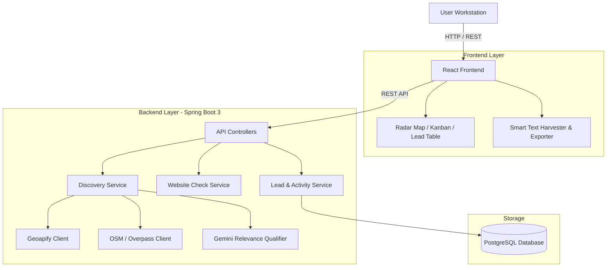

<p align="center">
  
</p>

# SETULEADS — STRUCTURAL WEB INSPECTION & PROSPECT DISCOVERY ENGINE

SetuLeads is a single-user prospect discovery and CRM workstation built for finding local and digital-first businesses that need web development, website revamps, or technical digital infrastructure upgrades.

─────────────────────────────────────────────

## 01  WHAT THIS IS

SetuLeads started from a simple problem: finding local businesses that actually need web work takes too many browser tabs.

Finding potential clients usually isn't the hardest part. The messy part is sifting through map markers, verifying whether a business actually has a functional website, checking basic SSL or mobile responsiveness, grabbing contact details, and organizing those prospects without drowning in a bloated enterprise CRM.

SetuLeads puts that process into one workstation interface:

```
FIND ──► VERIFY ──► INSPECT ──► QUALIFY ──► SAVE ──► CONTACT
```

It combines local map discovery, manual digital-presence capture, automated website technical checks, and a lightweight sales pipeline.

─────────────────────────────────────────────

## 02  WORKFLOW ENGINE

The core pipeline processes raw candidates through controlled normalization stages:

```
Search Query
   │
   ▼
Multi-Source Discovery (Geoapify / OpenStreetMap)
   │
   ▼
Candidate Normalization & Deduplication
   │
   ▼
Gemini Relevance & Intent Qualification
   │
   ▼
Backend Website Inspection (HTTP / SSL / Mobile / Tech Debt)
   │
   ▼
CRM Workstation (Kanban / Inspection Drawer / Notes / Activity Log)
   │
   ▼
Outreach & SheetJS Excel Export
```

─────────────────────────────────────────────

## 03  DISCOVERY ARCHITECTURE

SetuLeads uses official, API-based sourcing rather than relying on a single provider directory or on scraping third-party platforms.

### Local & Map POI Discovery
- **Geoapify Places API**: Radius and spatial boundary queries for physical business locations.
- **OpenStreetMap / Overpass API**: Open geospatial data extraction for regional categories.

*Primary use case*: Local contractors, restaurants, repair shops, professional services, and physical storefronts.

### Digital-First Businesses: Smart Text Harvester

Map directories work well for physical storefronts, but early-stage businesses, creative agencies, and digital-first services often build a social or Linktree presence long before setting up a map listing or traditional website. Rather than scraping social platforms automatically (which would violate their Terms of Service), SetuLeads solves this with a manual, human-driven capture tool:

- You browse a business's public Instagram/LinkedIn/Linktree page yourself, in your own browser
- Copy the visible text (bio, contact info, links)
- Paste it into the **Smart Text Harvester** modal
- A regex-based parser extracts structured fields (business name, email, phone/WhatsApp, website, social handle) for your review before saving

This keeps every digital-first lead sourced from something you personally found and chose to capture — no automated scraping, no ToS risk, and every result already has your own eyes on it before it enters the CRM.

─────────────────────────────────────────────

## 04  QUALIFICATION & ACCURACY

A core principle in SetuLeads is that a raw discovery result is not automatically a qualified business:

```
DISCOVERY RESULT != QUALIFIED BUSINESS
```

Geoapify and OSM can return miscategorized points, administrative boundaries, or entities that aren't commercial businesses (parks, government offices, generic tagged nodes). Treating every raw result as a lead leads to a polluted database.

SetuLeads normalizes and qualifies candidates before elevating them to a usable lead:

- **Entity Type & Relevance**: Evaluates whether the candidate is a real commercial business versus non-commercial infrastructure.
- **Geographic Context**: Validates location markers against search intent, requiring real coordinates from a recognized provider.
- **Full Transparency**: Every candidate — qualified or not — is returned with its qualification tier and specific reasoning, rather than silently discarding anything that didn't pass. Quality over volume, but never quality *hidden from you*.

### Deduplication Strategy
Candidate records are matched across incoming streams using:
1. Provider unique identifier
2. Normalized domain name
3. Phone number
4. Social handle
5. Business name combined with geographic proximity

This strategy prevents duplicate entries while avoiding accidental merges of separate businesses with similar names.

─────────────────────────────────────────────

## 05  WEBSITE INSPECTION

When a website URL is discovered, SetuLeads performs an automated backend inspection to evaluate observable technical signals:

Endpoint: `POST /api/v1/websites/check`

### Observable Checks
- **HTTP Status Code**: Verifies site accessibility (e.g., `200 OK`, `404`, `500`).
- **Response Latency**: Measures initial server response time.
- **HTTPS & SSL Validity**: Checks for active SSL certificates.
- **Viewport Tag**: Verifies presence of mobile viewport meta tags.
- **Page Metadata**: Extracts page title and meta description.
- **Technical Debt Signals**: Identifies outdated design structures or missing performance markers.

If an inspection fails due to server timeouts or DNS errors, the record is flagged as `INSPECTION_FAILED` rather than fabricating a fake zero score.

*Note*: "No website discovered" is explicitly tracked separately from "Confirmed business has no website".

─────────────────────────────────────────────

## 06  CRM WORKSTATION

SetuLeads is designed as a focused single-user prospecting workspace rather than an enterprise multi-tenant CRM.

### Pipeline Stages
- `NEW`: Discovered and imported candidates awaiting initial contact.
- `CONTACTED`: First outreach sent.
- `REPLIED`: Prospect responded.
- `NEGOTIATING`: Proposal or audit discussion in progress.
- `WON`: Client engaged.
- `LOST`: Prospect declined or unsuitable.

### Key Capabilities
- **Kanban Board**: Drag-and-drop stage updates.
- **Inspection Drawer**: Deep dive into contact details, audit notes, social links, and activity logs.
- **Activity Log**: Endpoint `POST /api/v1/leads/{id}/activities` tracks call notes, stage updates, and email logs.
- **Excel Export**: Endpoint `GET /api/v1/leads/export` and client-side SheetJS generate formatted `.xlsx` spreadsheets for offline review.

─────────────────────────────────────────────

## 07  SYSTEM ARCHITECTURE

All external API calls and provider queries originate from the Spring Boot backend. The React frontend does not expose provider API keys.



─────────────────────────────────────────────

## 08  TECH STACK

### Frontend
- **Framework**: React 19, TypeScript, Vite
- **Styling**: Tailwind CSS v4, shadcn/ui, Framer Motion
- **Icons**: Phosphor Icons, Lucide Icons
- **State & Data Fetching**: TanStack Query (React Query v5)
- **Excel Export**: SheetJS (`xlsx`)

### Backend
- **Framework**: Java 17, Spring Boot 3.x
- **Data & Persistence**: Spring Data JPA, Hibernate, PostgreSQL
- **Export & Utilities**: Apache POI (`poi-ooxml`), Jakarta Validation
- **Build Tool**: Apache Maven

### Discovery & Intelligence
- **Geospatial**: Geoapify Places API, OpenStreetMap / Overpass API
- **AI Qualification**: Google Gemini API (`RelevanceQualifier`)

─────────────────────────────────────────────

## 09  PROJECT STRUCTURE

```
setuleads/
├── frontend/                     # Client application (React + Vite)
│   ├── src/
│   │   ├── api/                  # API client functions
│   │   ├── assets/               # Brand SVGs & static assets
│   │   ├── components/           # UI, layout, and visualizer components
│   │   ├── hooks/                # Custom React Query hooks
│   │   ├── lib/                  # Utilities & Excel exporter
│   │   └── pages/                # Main application views & Case Study
│   ├── public/                   # Favicon and static files
│   ├── index.html
│   ├── package.json
│   └── vite.config.ts
│
├── backend/                      # Service application (Spring Boot)
│   ├── src/
│   │   ├── main/java/com/setuleads/
│   │   │   ├── config/           # Web & CORS configuration
│   │   │   ├── controller/       # REST API endpoints
│   │   │   ├── dto/              # Request & Response Data Transfer Objects
│   │   │   ├── entity/           # JPA Database Entities
│   │   │   ├── integration/      # Geoapify, OSM & Gemini clients
│   │   │   ├── repository/       # Spring Data Repositories
│   │   │   └── service/          # Business logic & qualification engines
│   │   └── test/java/com/setuleads/
│   └── pom.xml
│
├── package.json                  # Root orchestration scripts
├── .gitignore
└── README.md
```

─────────────────────────────────────────────

## 10  LOCAL SETUP

### Prerequisites
- Node.js v18+
- JDK 17+
- Maven 3.8+
- PostgreSQL database instance

### 1. Environment Configuration

Create a `.env` file inside `frontend/` (copy from `.env.example`, never commit the real file):
```env
VITE_API_BASE_URL=http://localhost:8080
```

Configure backend environment variables in `backend/.env` or export them in your shell/IDE (see `backend/.env.example`):
```env
GEOAPIFY_API_KEY=your_geoapify_key
GEMINI_API_KEY=your_gemini_key

# Database Configuration (Optional - defaults to in-memory H2 if omitted)
SPRING_DATASOURCE_URL=jdbc:postgresql://localhost:5432/setuleads
SPRING_DATASOURCE_USERNAME=your_db_user
SPRING_DATASOURCE_PASSWORD=your_db_password
```

### 2. Frontend Development Server

```bash
# From project root
cd frontend
npm install
npm run dev
```
The frontend will start at `http://localhost:5173`.

### 3. Backend Service Server

```bash
# From project root
cd backend
mvn spring-boot:run
```
The backend API server will run on `http://localhost:8080`.

─────────────────────────────────────────────

## 11  TESTING & VERIFICATION

### Automated Verification Commands

```bash
# Execute Frontend Production Build
npm run build

# Execute Backend Test Suite
npm run test:backend
```

### Manual Verification Checklist
- **Search Execution**: Run a real query (e.g., "Plumbers in Austin, TX") and verify candidates are returned.
- **Provider Fallback**: Verify discovery handles API failures gracefully without crashing the UI, and that provider status is visible when a search returns zero raw signals.
- **Smart Text Harvester**: Paste a raw text block into the Harvester modal and verify extracted fields.
- **Website Inspection**: Trigger inspection on a lead and verify response code, SSL status, and viewport flags.
- **Pipeline Stage Sync**: Drag a lead across Kanban columns and confirm database persistence.
- **Excel Export**: Click "Export to Excel" and verify the generated `.xlsx` file.

─────────────────────────────────────────────

## 12  REST API REFERENCE

| Method | Endpoint | Description |
| :--- | :--- | :--- |
| `POST` | `/api/v1/discovery/search` | Trigger multi-source candidate discovery query |
| `POST` | `/api/v1/websites/check` | Execute backend technical website inspection |
| `GET` | `/api/v1/leads` | Retrieve leads list with optional stage/source filtering |
| `GET` | `/api/v1/leads/{id}` | Retrieve single lead details |
| `POST` | `/api/v1/leads` | Save a new qualified lead manually |
| `PUT` | `/api/v1/leads/{id}` | Update existing lead record details |
| `DELETE` | `/api/v1/leads/{id}` | Remove a lead record |
| `POST` | `/api/v1/leads/{id}/stage` | Update pipeline stage (`NEW`, `CONTACTED`, etc.) |
| `POST` | `/api/v1/leads/harvest-paste` | Parse raw pasted text and import a manually-captured candidate |
| `POST` | `/api/v1/leads/generate-outreach` | Generate personalized AI pitch hook for a candidate |
| `GET` | `/api/v1/leads/{leadId}/activities` | Get activity log for a specific lead |
| `POST` | `/api/v1/leads/{leadId}/activities` | Log a new note, call, or email activity |
| `GET` | `/api/v1/leads/export` | Download formatted `.xlsx` Excel spreadsheet |

─────────────────────────────────────────────

## 13  DESIGN SYSTEM

SetuLeads utilizes a **Dark Editorial Brutalist** visual identity focused on information density, high contrast, and architectural layout boundaries.

```
┌─────────────────────────────────────────────────────────┐
│ COLOR PALETTE                                           │
├─────────────────────────────────────────────────────────┤
│ #080808   Deep Black Base Canvas                        │
│ #101010   Workstation Panel Surface                     │
│ #151515   Elevated Card Surface                         │
│ #222222   Architectural Grid Borders                    │
│ #FF4A00   Burnt Tactical Orange (Target & Action)       │
│ #00E599   Cyber Emerald (Success & Live Status)         │
│ #F4F0E8   Warm Editorial White (Primary Text)           │
│ #8E8982   Muted Text & Monospace Metadata               │
└─────────────────────────────────────────────────────────┘
```

- **Black** forms the workstation canvas.
- **Burnt Orange** highlights active targets, primary actions, and radar sweeps.
- **Cyber Emerald** indicates valid status signals and operational health.
- **Warm White** provides high-contrast text readability against dark surfaces.
- **Borders** act as thin architectural inspection lines.

─────────────────────────────────────────────

## 14  CURRENT LIMITATIONS

- **Candidate Filtering**: Automated relevance qualification drastically reduces noise, but edge cases can yield occasional false positives — every candidate's reasoning is visible for review, not just the score.
- **Observable Inspection**: Backend website checks evaluate observable technical headers, SSL certificates, and DOM markers—not server-side internal source code.
- **Contact Completeness**: Some discovered local businesses publish phone numbers but omit direct email addresses.
- **Digital-First Coverage**: Businesses with no map listing and no website require manual discovery via the Smart Text Harvester rather than automated sourcing — a deliberate trade-off to avoid scraping social platforms in violation of their Terms of Service.

─────────────────────────────────────────────

## 15  ROADMAP

- Expanded technical audit rules for performance metrics and CMS detection.
- Custom outreach email template builder with variable tag substitution.
- Optional webhook notifications for automated background harvest runs.
- Broader geographic query coverage and additional official, API-based discovery sources.

─────────────────────────────────────────────

SETULEADS
Find the signal. Check the structure. Keep the lead.

Built as a focused prospecting workstation.